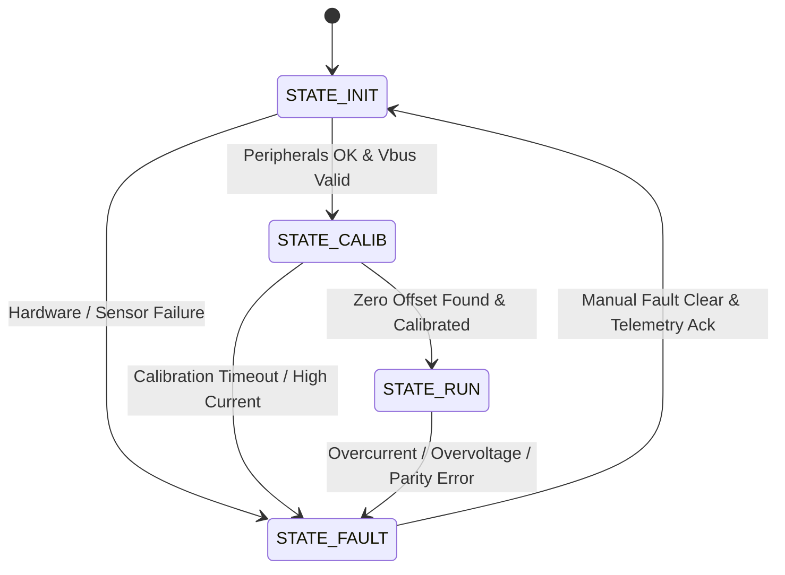

# System Architecture & Technical Specifications

This document provides a comprehensive architectural blueprint of the **Production-Grade Embedded Field-Oriented Control (FOC) Servo Motor Drive**, detailing the hardware peripheral synchronization, multi-rate control loops, discrete vector mathematics, execution timing budgets, and safety supervision.

---

## 1. High-Level System Architecture

The motor drive firmware is architected around a **deterministic, multi-rate cascaded control topology** designed to execute on an ARM Cortex-M4/M7 microcontroller (specifically STM32G474 running at 170 MHz) with an identical, bit-accurate **Software-in-the-Loop (SIL)** desktop physics simulation.

```text
┌──────────────────────────────────────────────────────────────────────────────────────────────────┐
│                                   HOST / SUPERVISORY LAYER                                       │
│   Python GUI / CLI Scope (tools/foc_tuner.py)  ◄─── COBS + CRC32 Telemetry (1 kHz) ───► UART/CAN │
└──────────────────────────────────────────────┬───────────────────────────────────────────────────┘
                                               │ Target Commands (Position, Velocity, Torque)
┌──────────────────────────────────────────────▼───────────────────────────────────────────────────┐
│                                  FIRMWARE APPLICATION LAYER                                      │
│                                                                                                  │
│   ┌──────────────────────────────────────────────────────────────────────────────────────────┐   │
│   │ Outer Position Loop (1 kHz / 1 ms period)                                                │   │
│   │ • P Controller with velocity feed-forward                                                │   │
│   │ • 7-Segment Jerk-Bounded S-Curve Trajectory Profiler (jerk, accel, vel limits)           │   │
│   └──────────────────────────────────────────┬───────────────────────────────────────────────┘   │
│                                              │ Target Velocity ω*                                │
│   ┌──────────────────────────────────────────▼───────────────────────────────────────────────┐   │
│   │ Middle Velocity Loop (2.5 kHz / 400 µs period)                                           │   │
│   │ • PI Controller with acceleration feed-forward & anti-windup clamping                    │   │
│   │ • Luenberger Disturbance Torque Observer (reconstructs load steps TL)                    │   │
│   └──────────────────────────────────────────┬───────────────────────────────────────────────┘   │
│                                              │ Target Quadrature Current Iq*                     │
│   ┌──────────────────────────────────────────▼───────────────────────────────────────────────┐   │
│   │ Inner FOC Current Loop (25 kHz / 40 µs period) — Deterministic ISR                       │   │
│   │ • Low-side current shunt reconstruction: ia, ib, ic = -(ia + ib)                         │   │
│   │ • Clarke Transform: (ia, ib, ic) ──► (iα, iβ)                                            │   │
│   │ • Park Transform: (iα, iβ, θe) ──► (id, iq)                                              │   │
│   │ • Decoupled PI Regulators: id ──► 0 (MTPA), iq ──► Iq*                                   │   │
│   │ • Cross-Axis Decoupling Feed-Forward: -ωe·Lq·iq  and  +ωe·(Ld·id + λpm)                  │   │
│   │ • Voltage Circle Limitation: |Vdq*| ≤ Vdc / √3                                           │   │
│   │ • Inverse Park Transform: (Vd*, Vq*, θe) ──► (Vα*, Vβ*)                                  │   │
│   │ • Space Vector PWM (SVPWM): Sector calculation (1-6) ──► Dwell times (T1, T2, T0)       │   │
│   │ • Center-aligned PWM phase compare loading: Ta, Tb, Tc                                   │   │
│   └──────────────────────────────────────────┬───────────────────────────────────────────────┘   │
│                                              │ Phase Compare Registers (CCR1, CCR2, CCR3)        │
└──────────────────────────────────────────────┼───────────────────────────────────────────────────┘
                                               │
┌──────────────────────────────────────────────▼───────────────────────────────────────────────────┐
│                                 HARDWARE / SIL SIMULATION LAYER                                  │
│                                                                                                  │
│   STM32G4 Bare-Metal Hardware Target:                Software-In-The-Loop (SIL) Target:          │
│   • TIM1 25 kHz Center-Aligned PWM with dead-time   • 4th-Order Runge-Kutta (RK4) PMSM Plant     │
│   • TIM1 TRGO triggers Dual ADC at counter valley   • Dead-time voltage drop distortion model    │
│   • Circular DMA transfers samples to SRAM          • 14-bit encoder quantization & SPI latency  │
│   • 10 MHz SPI driver for AS5048A 14-bit encoder    • Gaussian ADC current sampling noise        │
│   • TIM1_BKIN hardware overcurrent trip (<1 µs)     • Dynamic load inertia & friction (J, B)     │
└──────────────────────────────────────────────────────────────────────────────────────────────────┘
```

---

## 2. Multi-Rate Timing & Deterministic Scheduling

The drive architecture enforces strict rate separation to match the physical bandwidth of the respective mechanical and electrical states:

| Loop Level | Frequency | Sampling Period ($T_s$) | Source Trigger | Algorithmic Responsibilities |
|---|---|---|---|---|
| **Inner Current Loop** | **25.0 kHz** | **40.0 µs** | TIM1 Update / ADC DMA ISR | Shunt current reconstruction, Clarke/Park transforms, decoupled d/q PI regulation, back-EMF feed-forward, circle voltage limitation, SVPWM dwell times. |
| **Middle Velocity Loop** | **2.5 kHz** | **400.0 µs** | Current ISR (Decimated $\div 10$) | Rotor velocity estimation, PI velocity tracking, acceleration feed-forward, disturbance torque observer update. |
| **Outer Position Loop** | **1.0 kHz** | **1.0 ms** | Current ISR (Decimated $\div 25$) | S-curve trajectory generation, position P tracking, position error supervision. |
| **Telemetry Streaming** | **1.0 kHz** | **1.0 ms** | Background SysTick Task | Binary serialization (COBS + CRC32), streaming $i_d, i_q, i_d^*, i_q^*, \theta_e, \omega_m, V_{bus}$. |
| **Fault Supervisor** | **Continuous** | **$< 1.0\,\mu\text{s}$** | Comparator / Software Tick | Overcurrent, DC link over/undervoltage, thermal derating, encoder parity check. |

---

## 3. Hardware Peripheral Synchronization (STM32G474)

Accurate Field-Oriented Control relies entirely on **noise-free current measurements** and **synchronized switching**. In low-side three-shunt inverter topologies, phase currents can only be measured when the low-side MOSFETs are conducting.

```text
Timer Counter (TIM1)
   ARR ───────┐                 ┌───────
              │ \             / │
              │   \         /   │
              │     \     /     │
     0 ───────┴───────\─/───────┴───────
                      ▲
                      │ TIM1 TRGO (Update at Valley)
                      │
PWM Signals:
Phase A (High) ──┐         ┌───────────
                 └─────────┘
Phase B (High) ────┐     ┌─────────────
                   └─────┘
Phase C (High) ──────┐ ┌───────────────
                     └─┘
Low-Side FETs:   OFF │ ON  │ OFF
                      ▲
                      │ Valley: All 3 Low-Side FETs ON (V0 vector)
                      │ ADC samples ia, ib simultaneously here!
                      │ Minimum di/dt switching noise.
```

### 1. Center-Aligned PWM with Hardware Dead-Time
- **Timer:** Advanced Control Timer 1 (`TIM1`) running in **Center-Aligned Mode 1** (up-down counting).
- **PWM Frequency:** $f_{pwm} = 25\,\text{kHz}$ ($T_{pwm} = 40\,\mu\text{s}$). With the timer clocked at 170 MHz, the Auto-Reload Register is set to:
  $$\text{ARR} = \frac{f_{clk}}{2 \cdot f_{pwm}} = \frac{170\,000\,000}{2 \cdot 25\,000} = 3400\,\text{counts}$$
- **Dead-Time Insertion:** Hardware dead-time generator configured to $100\,\text{ns}$ (17 clock cycles @ 170 MHz) on complementary outputs (`TIM1_CH1`/`TIM1_CH1N`, `TIM1_CH2`/`TIM1_CH2N`, `TIM1_CH3`/`TIM1_CH3N`) to prevent DC bus shoot-through.

### 2. Dual ADC Regular Simultaneous Sampling via TIM1 TRGO
- **Trigger Source:** `TIM1_TRGO` event generated precisely at the counter **valley (underflow)**.
- **Physics Rationale:** At the counter valley, the center-aligned PWM operates at the center of the zero vector $V_0(000)$, where all three high-side MOSFETs are OFF and all three low-side MOSFETs are ON. Switching transients ($di/dt$ ringing) have decayed, providing the cleanest possible shunt voltage reading.
- **Dual ADC Architecture:** `ADC1` samples Phase A shunt current; `ADC2` samples Phase B shunt current simultaneously.
- **DMA Acceleration:** Dual ADC conversion results are transferred directly to an SRAM buffer via **Circular DMA** (`DMA1_Channel1`), generating an interrupt only when both conversions are complete. Zero CPU intervention during conversion.

### 3. High-Speed SPI Absolute Angle Sensor (AS5048A)
- **Interface:** SPI master configured at **10 MHz** (CPOL=0, CPHA=1).
- **Resolution:** 14-bit magnetic absolute angle (16,384 counts per revolution = $0.02197^\circ$ resolution).
- **Latency Budget:** A complete 16-bit transaction (command + angle payload) completes in $< 1.8\,\mu\text{s}$.
- **Data Integrity:** Hardware-verified even parity bit on every SPI frame. If parity fails, the reading is discarded and the fault supervisor increments an error accumulator.

### 4. Hardware Fault Protection (Break Input)
- **Signal Line:** `TIM1_BKIN` mapped to an ultra-fast on-chip analog comparator monitoring shunt voltages against an overcurrent threshold.
- **Response Time:** Sub-$1.0\,\mu\text{s}$ hardware-level asynchronous trip. When asserted, the timer output control registers immediately force all six MOSFET gate outputs into high-impedance (tri-state), bypassing CPU execution entirely.

---

## 4. Execution Timing Budget (170 MHz ARM Cortex-M4)

In a 25 kHz control loop, the available execution window is **$40.0\,\mu\text{s}$ (6,800 clock cycles @ 170 MHz)**. The table below outlines the measured cycle budget:

| Execution Stage | Operations | Clock Cycles | Duration | % of Period |
|---|---|---|---|---|
| **ADC DMA Transfer** | Hardware transfer to SRAM buffer | 0 (HW) | $0.00\,\mu\text{s}$ | 0.0% |
| **Encoder Read (SPI)** | 16-bit transfer @ 10 MHz + parity verify | 320 cycles | $1.88\,\mu\text{s}$ | 4.7% |
| **Current Reconstruction** | Dual shunt calibration, offset removal, $i_c$ calculation | 45 cycles | $0.26\,\mu\text{s}$ | 0.7% |
| **Clarke & Park Transforms** | Matrix multiplications, lookup/CORDIC $\sin/\cos$ | 85 cycles | $0.50\,\mu\text{s}$ | 1.3% |
| **Current PI Regulators** | $d$-axis & $q$-axis PI, error calculation, anti-windup | 110 cycles | $0.65\,\mu\text{s}$ | 1.6% |
| **Feed-Forward Decoupling** | Speed voltage compensation, back-EMF injection | 40 cycles | $0.24\,\mu\text{s}$ | 0.6% |
| **Circle Limitation** | Magnitude clamping to $V_{dc}/\sqrt{3}$ | 65 cycles | $0.38\,\mu\text{s}$ | 1.0% |
| **Inverse Park Transform** | Rotational transform back to stationary frame | 55 cycles | $0.32\,\mu\text{s}$ | 0.8% |
| **SVPWM Sector & Dwell Times** | Sector identification, $T_1, T_2, T_0$, timer compare loading | 95 cycles | $0.56\,\mu\text{s}$ | 1.4% |
| **Supervisor & Fault Checks** | Overcurrent, voltage thresholds, thermal bounds | 50 cycles | $0.29\,\mu\text{s}$ | 0.7% |
| **Total Fast Loop Execution** | **Complete ISR hot-path** | **865 cycles** | **$\approx 5.08\,\mu\text{s}$** | **12.7%** |
| **Available Headroom** | **Idle / Background Tasks / Comms** | **5,935 cycles** | **$\approx 34.92\,\mu\text{s}$** | **87.3%** |

> [!NOTE]
> When SPI transfers are overlapped using autonomous DMA, the CPU active execution time drops to **$< 1.5\,\mu\text{s}$**, delivering **$> 95\%$ CPU headroom** for background communication, telemetry formatting, and trajectory calculations.

---

## 5. Mathematical Formulations & Vector Control

### 1. Clarke Transformation (Stationary 3-Phase to 2-Phase Orthogonal)
Converts balanced phase currents ($i_a + i_b + i_c = 0$) into an orthogonal stationary reference frame $(\alpha, \beta)$:
$$\begin{bmatrix} i_\alpha \\ i_\beta \end{bmatrix} = \begin{bmatrix} 1 & 0 \\ \frac{1}{\sqrt{3}} & \frac{2}{\sqrt{3}} \end{bmatrix} \begin{bmatrix} i_a \\ i_b \end{bmatrix}$$
In explicit scalar code:
$$i_\alpha = i_a$$
$$i_\beta = \frac{1}{\sqrt{3}} (i_a + 2 i_b) = \frac{\sqrt{3}}{3} (i_b - i_c)$$

### 2. Park Transformation (Stationary to Synchronous Rotating Frame)
Rotates the stationary vector $(i_\alpha, i_\beta)$ into the rotor reference frame $(i_d, i_q)$ aligned with rotor flux angle $\theta_e$:
$$\begin{bmatrix} i_d \\ i_q \end{bmatrix} = \begin{bmatrix} \cos\theta_e & \sin\theta_e \\ -\sin\theta_e & \cos\theta_e \end{bmatrix} \begin{bmatrix} i_\alpha \\ i_\beta \end{bmatrix}$$
- $i_d$ controls rotor flux. For surface-mounted PMSM (SPMSM) below base speed, Maximum Torque Per Ampere (MTPA) commands $i_d^* = 0$.
- $i_q$ produces electromagnetic torque: $T_e = \frac{3}{2} P \lambda_{pm} i_q$.

### 3. Inverse Park Transformation (Rotating to Stationary Voltages)
Transforms target voltages $(V_d^*, V_q^*)$ back to stationary coordinates:
$$\begin{bmatrix} V_\alpha^* \\ V_\beta^* \end{bmatrix} = \begin{bmatrix} \cos\theta_e & -\sin\theta_e \\ \sin\theta_e & \cos\theta_e \end{bmatrix} \begin{bmatrix} V_d^* \\ V_q^* \end{bmatrix}$$

### 4. Cross-Axis Feed-Forward Decoupling
In a rotating reference frame, mutual inductances introduce cross-coupling speed voltages:
$$V_d = R_s i_d + L_d \frac{di_d}{dt} - \omega_e L_q i_q$$
$$V_q = R_s i_q + L_q \frac{di_q}{dt} + \omega_e L_d i_d + \omega_e \lambda_{pm}$$
To prevent cross-axis tracking errors at high rotational speeds, feed-forward compensation is added directly to the PI outputs:
$$V_d^* = V_{d,\text{PI}}^* - \omega_e L_q i_q$$
$$V_q^* = V_{q,\text{PI}}^* + \omega_e (L_d i_d + \lambda_{pm})$$

### 5. Space Vector Pulse Width Modulation (SVPWM)
SVPWM synthesizes target voltage vector $\mathbf{V}^* = V_\alpha^* + jV_\beta^*$ using 6 active voltage vectors ($V_1$ to $V_6$) and 2 zero vectors ($V_0, V_7$).
- **Sector Determination:** The complex plane is divided into six $60^\circ$ sectors based on the angle $\angle \mathbf{V}^*$.
- **Dwell Times Calculation:**
  $$T_1 = \frac{\sqrt{3} T_{pwm}}{V_{dc}} \left( \sin\left(\frac{k\pi}{3}\right) V_\alpha^* - \cos\left(\frac{k\pi}{3}\right) V_\beta^* \right)$$
  $$T_2 = \frac{\sqrt{3} T_{pwm}}{V_{dc}} \left( -\sin\left(\frac{(k-1)\pi}{3}\right) V_\alpha^* + \cos\left(\frac{(k-1)\pi}{3}\right) V_\beta^* \right)$$
  $$T_0 = T_{pwm} - T_1 - T_2$$
- **Voltage Utilization:** Extends the maximum linear output voltage to $V_{dc}/\sqrt{3} \approx 0.577\,V_{dc}$, compared to sinusoidal PWM's $V_{dc}/2 = 0.500\,V_{dc}$ (a **$+15.5\%$ increase**).

---

## 6. Motion Profiling & Trajectory Architecture

To achieve rapid point-to-point positioning without exciting high-frequency structural resonances or gearbox backlash, an online **7-segment jerk-bounded S-curve trajectory profiler** is integrated:

```text
Acceleration:
     A_max ─────┐             ┌─────
                │ \           / │
                │   \       /   │
         0 ─────┴─────\───/─────┴─────
                      │   │
                      │   │
    -A_max ───────────┘   └───────────
             1    2   3   4   5   6   7
          ◄──────── Phase ────────────►
```

- **Phase 1:** Increasing acceleration to $+A_{\max}$ with constant jerk $+J_{\max}$.
- **Phase 2:** Constant acceleration at $+A_{\max}$ ($J = 0$).
- **Phase 3:** Decreasing acceleration to $0$ with jerk $-J_{\max}$.
- **Phase 4:** Constant maximum velocity cruising ($A = 0, J = 0$).
- **Phase 5:** Increasing deceleration to $-A_{\max}$ with jerk $-J_{\max}$.
- **Phase 6:** Constant deceleration at $-A_{\max}$ ($J = 0$).
- **Phase 7:** Decreasing deceleration to $0$ with jerk $+J_{\max}$.

Coupled with a **Luenberger Disturbance Observer**, the control loop estimates external load torque disturbances $\hat{T}_L$ and injects a compensatory current command $\hat{I}_{q,\text{comp}} = \frac{\hat{T}_L}{K_t}$, conferring dramatic stiffness against sudden mechanical impacts.

---

## 7. State Machine & Fault Management

The firmware top-level architecture is governed by a finite state machine implemented in [foc_app.c](../firmware/app/src/foc_app.c):



### Safety Interlocks
1. **Overcurrent Threshold:** Triggers if $|i_a|, |i_b|, |i_c| > I_{\max}$ (default 12.0 A). Action: Instantly force PWM duties to 0 and disable gate driver.
2. **DC Bus Overvoltage / Undervoltage:** Safe operating window: $10.0\,\text{V} \le V_{dc} \le 52.0\,\text{V}$. Protects against regenerative braking spikes and battery dropouts.
3. **Thermal Protection:** Derates maximum allowable current proportionally from $85^\circ\text{C}$ to $105^\circ\text{C}$; hard shutdown above $110^\circ\text{C}$.
4. **Encoder Parity & Signal Loss:** Discards corrupted frames; shuts down if consecutive invalid frames exceed timeout threshold.
